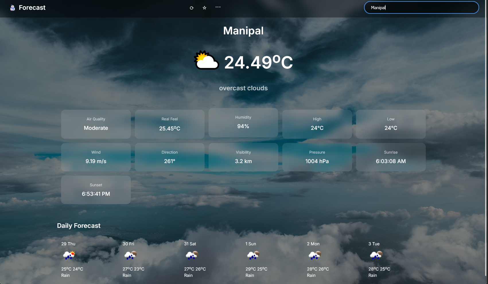
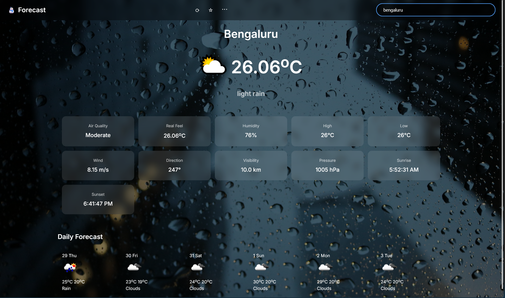
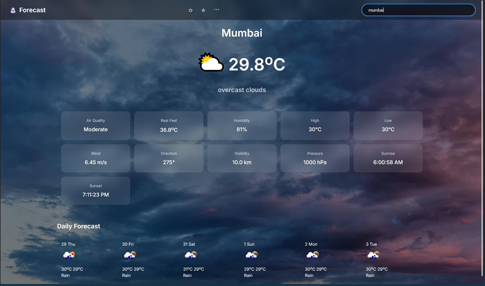
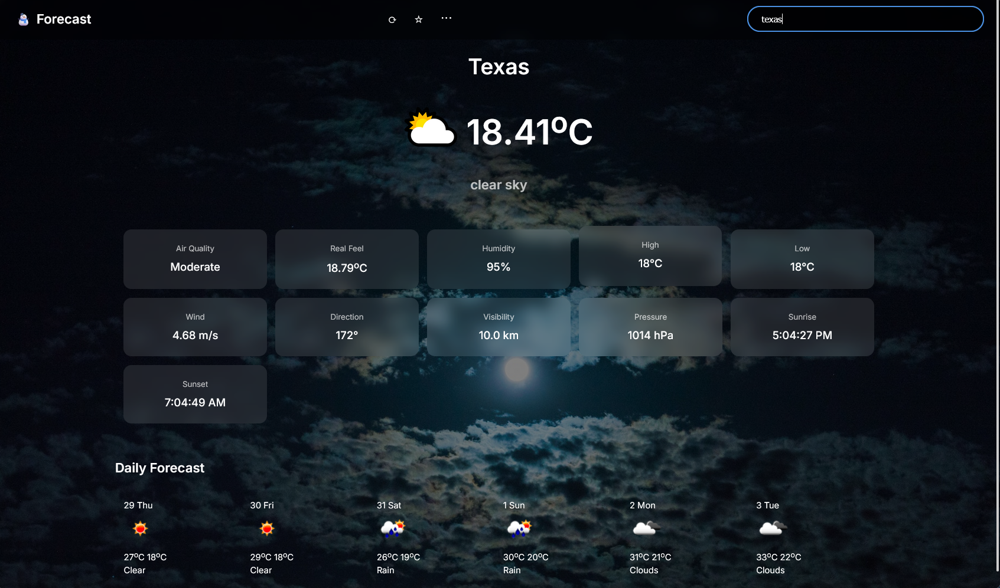

# 🌦️ Modern Weather App – Powered by OpenWeatherMap API

A personalized and redesigned weather app built using HTML, CSS, and JavaScript.  
It features real-time weather data, dynamic visuals, and a modern user interface using glassmorphism.

🚀 [Live Website](https://nathansweatherapp.netlify.app)


---

## ✨ Features

- Sleek, modern UI with glassmorphism styling
- Real-time weather data for any city worldwide
- Detailed weather breakdown:
  - Current temperature and condition
  - Real feel, humidity, wind speed & direction
  - Visibility, pressure, sunrise & sunset times
  - 7-day forecast
- Dynamic backgrounds that:
  - Adjust based on weather conditions
  - Consider time of day (day/night)
  - Randomly select from multiple relevant images
- Smooth animations and transitions
- Fully responsive design for desktop and mobile

---

## 🧠 How It Works

- Type any city name in the search bar and press **Enter**
- Weather data is fetched and displayed dynamically
- Use:
  - **Refresh button (⟳)** to update the data
  - **Favorite button (☆)** – placeholder for future feature
  - **Menu button (···)** – expandable for more options
- App loads with **London's weather** by default

---

## 📷 Screenshots

*(Make sure the screenshots are placed in a `/screenshots` folder in your repo)*

  
  
  
  

---

## ⚙️ Configuration

To use the OpenWeatherMap API:

1. Visit [https://openweathermap.org](https://openweathermap.org)
2. Create a free account and get your API key
3. In the project directory, open `script.js`
4. Replace:

```js
const API_KEY = 'YOUR_API_KEY';
